# The Beatles Quiz

Welcome to my The Beatles Quiz! Test your Fab Four knowledge with three exciting difficulty levels:

Easy: Fill in the missing word from iconic Beatles lyrics. Choose the right one from four options.

Medium: Identify the album a Beatles song belongs to. Pick the correct album from four choices.

Hard: Dive into challenging Beatles facts and trivia. Select the right answer from four options.

Press "Start Quiz," choose your difficulty, and get ready! Your goal is to answer as many questions as you can correctly. Good luck, and may your Beatles knowledge shine!
Dont forget to save your highscore at the end!

You got 10 seconds to answer each question!

Remember the harder the difficulty the more points you get!🎸

[Link to the website](https://jorgendif.github.io/the-beatles-quiz/index.html)

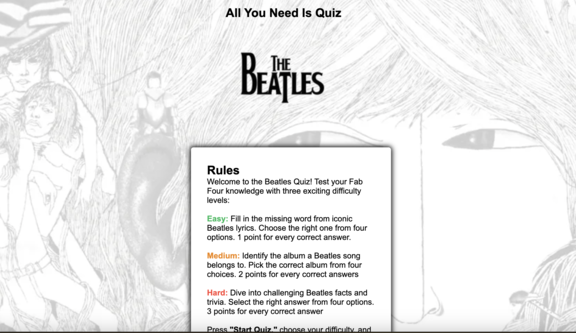

# Content

**Table of content:**

- [Introduction](#introduction)
  - [Am I Responsive](#responsive)
- [UX](#ux)
  - [The Strategy](#the-strategy)
  - [The Scope](#the-scope)
  - [The Structure](#the-structure)
  - [The Skeleton](#the-skeleton)
  - [The Surface](#the-surface)
- [User Experience](#user-experience)
  - [First Time User](#first-time-user)
  - [Returning User](#returning-user)
  - [Frequent User](#frequent-user)
- [Feauters](#feauters)
  - [The Main Page 1](#maine-page1)
  - [The Main Page 2](#maine-page2)
  - [The Main Page 3](#maine-page3)
  - [The Start Menu](#start-menu)
  - [The Question](#the-question)
  - [Answered Question](answered-question)
  - [The End Page](#the-end-page)
  - [The High Score Page](#the-highscore)
- [Technologies](#technologies)
  - [Language](#language)
  - [Tools](#tools)
- [Testing](#testing)
  - [Manual Testing](#manual-testing)
  - [Lighthouse](#lighthouse)
  - [Browser Test](#browser-test)
  - [Validation](#validation)
  - [Bugs](#bugs)
- [Deployment](#deployment)
  - [Deployment To Github](#deployment-to-github)
  - [Local Deployment](#local-deployment)
- [Credit](#credit)
  - [Content](#credit-content)
  - [Images](#images)
  - [Thank You](#thank-you)

<a id=responsive>

### Am I Responsive?

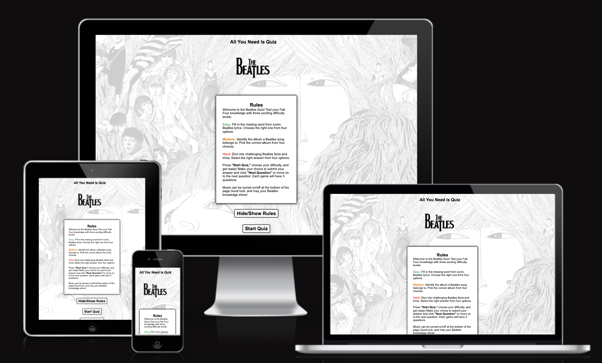

<a id=ux>

## UX

<a id=the-strategy>

### The Strategy

- My strategy centered around crafting an engaging and enjoyable Beatles quiz that would appeal to a broad audience.
- I aimed to go beyond the conventional question formats by incorporating music-related queries using Spotify.
- While initially considering the ambitious idea of recording Beatles songs in different styles, I acknowledged the current limitations of my JavaScript proficiency.

<a id=the-scope>

### The Scope

- Envisioning a unique Beatles quiz experience, I strived to offer more than just a standard set of questions.
- The incorporation of music questions, especially with Spotify integration, was a key aspect of my strategy.

- Although the aspiration to reimagine Beatles songs in various styles required advanced JavaScript skills, it remains a future prospect.

<a id=the-structure>

### The Structure

- To ensure the quiz's distinctiveness, I opted for three difficulty levels, each featuring diverse question types.
- The inclusion of a scoring system for each level aimed to provide users with a comprehensive assessment of their performance.

<a id=the-skeleton>

### The Skeleton

- For meticulous planning and visualization, I utilized Balsamiq to create wireframes.
- These wireframes served as a strategic guide, offering a clear blueprint for the quiz layout and design.

- [Wireframes Iphone](/documents/wireframes/ipad/)
- [Wireframes Ipad](/documents/wireframes/ipad/)
- [Wireframes Laptop](/documents/wireframes/laptop/)

<a id=the-surface>

### The Surface

- In the finalization phase, my strategy solidified with the decision to include 5 questions per difficulty level, each accompanied by a specific scoring system.
- The addition of a 10-second timer introduced an element of challenge.
- Inspired by the visual style of my previous project, I incorporated a background with opacity for a cohesive and visually appealing design.
- The project's foundation was laid by following a tutorial on YouTube, and proper credits to the tutorial creator were acknowledged.
- The strategic decision to embed a Beatles playlist aligns with the goal of making the quiz not just a test of knowledge but a holistic and enjoyable encounter for participants. This musical touch contributes to the immersive and entertaining nature of the game, fostering a connection with the iconic soundscape of The Beatles.

<a id=ux>

# User Experience

<a id=first-time-user>

### First Time User

- Quick Onboarding: The first-time user should be able to quickly understand how to play and initiate the game.
- Fun and Challenge: The game should provide both entertainment and challenge to make the initial experience enjoyable.
- Simultaneous Enjoyment: The user should be able to play the game and listen to Beatles songs concurrently for a more engaging experience.

<a id=returning-user>

### Returning User

- Score Comparison: Returning users should have the opportunity to replay the game and compare their current score with their previous performance.
- Exploration of Difficulty Levels: Users returning to the game might want to explore different difficulty levels to discover their preference.

<a id=frequent-user>

### Frequent User

- Variety in Questions: Frequent users should encounter a more diverse set of questions to maintain interest and prevent boredom.
- Expansion of Game Modes: The quiz should evolve to introduce new game modes or features to keep frequent users engaged.
- Diversification to Other Artists: As a long-term user, there might be an interest in expanding the quiz to include questions about other artists or providing links to quizzes about similar bands.
- These user experience goals ensure that the quiz caters to the needs and preferences of different types of users, offering a well-rounded and engaging experience for all.

<a id="design">

### Design
 My main focus is on keeping things clean and simple.

* I've embraced a minimalist design using a black and white color palette.
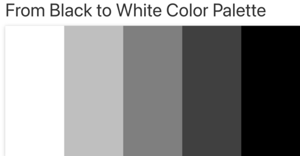

* For correct and incorrect I use green and red

* The font-family is set to Arial, Helvetica, sans-serif, ensuring simplicity in typography.

* The deliberate use of opacity in the background images adds a touch of sophistication, maintaining an overall sense of simplicity and cleanliness.

<a id="feauters">

#  Features
    
  <a id="maine-page1">

### The Main Page 1
* The main page, like the rest of the site, is fully responsive. 
* Initiating the game automatically conceals the rules while transforming the start button into a restart button. 
* Additionally, users have the option to manually hide the rules.

* The background image across all pages is the cover of The Beatles album "Revolver." It provides a consistent visual theme throughout the entire quiz.

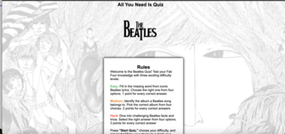

<a id="maine-page2">

### The Main Page 2
* Further down the page, you'll find a link to the high score page, along with the Beatles playlist I curated from Spotify.

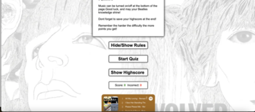
<a id="maine-page3">

### The Main Page 3

* This is what it looks like when you hide the rules

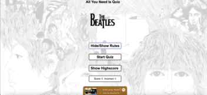
<a id="start-menu">

### The Start Menu
* This is where the game begins. It initiates as soon as you've selected your preferred difficulty level. 
* The rules are concealed, a 10-second timer is set, and you're off.
* At the bottom, you can keep track of correct and incorrect answers. If you dont answer within 10 seconds your answer will be incorrect

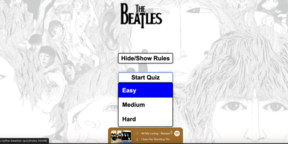

<a id="the-question">

### The Question
* This is the question layout. Four options are presented, the timer is displayed in the top left corner, and the question number is indicated above.
* The quiz questions, as well as the answer options, are randomized, ensuring a varied and dynamic experience for users. This adds an element of unpredictability to each round of the quiz.

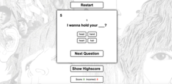

<a id ="answered-question">

### Answered Question

This is the appearance when a question is answered. The color red is used for incorrect answers, while green indicates correct answers. In the case of the timer running out, the result is treated as an incorrect answer.

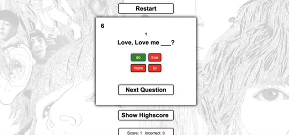

<a id="the-end-page">

### The End Page

After completing the quiz, you'll land on the end page. Here, you have two options: sign your name to check if you've made it to the high score list or simply return home

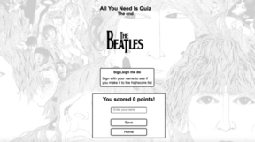

<a id="the-highscore">

### The High Score Page

This is the High Score Page! Find out if you've made it to the top 5 and see your name shine. If not, feel free to return home and give it another go!

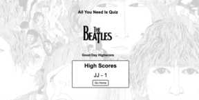

<a id="technologies">

#  Technologies

<a id="languages">

### Languages

* HTML
* CSS
* JavaScript

<a id="tools">

### Tools

* Balsamiq: Used for creating wireframes.
* VSCode: Utilized for writing and editing HTML, CSS, and JavaScript.
* GitHub: Employed for code deployment.
* JSHint: Applied for validating JavaScript code and identifying unused functions.
* CSS Validator: Utilized for validating CSS code.
* HTML Validator: Used for validating HTML code.
* Am I Responsive: Employed for testing and ensuring responsiveness.

<a id="testing">

#  Testing

### Manual Testing

| Feature              | Description                 | Steps                             | Outcome                      |
| --- | --- | ---| --- |
| Hide/Show The Rules  Button | Hide or show the rules      | Click "Hide/Show Rules" button   | Rules are hidden or displayed |
| Start Button   |  Open the start menu   |   Click "Start" button  |  Start menu opened |
| Easy Button    | Start game on easy mode  |  Click "Easy" button  | Game started with easy difficulty  |
| Medium Button    | Start game on medium mode  |  Click "Medium" button  | Game started with medium difficulty  |
| Hard Button    | Start game on hard mode  |  Click "Hard" button  | Game started with hard difficulty  |
| Show Highscore Button  | Show Highscore  |  Click "Show Highscore"  |  Redirected to highscore page  |
| Question 1-5 easy mode wrong answers | Wrong Answer should be red and increase incorrect answers . Also the other options should have correct colors.| Click on wrong answer option | The option turns red, and the incorrect answers increase. Every button gets the right color. Incorrect turns red and the correct green |
| Question 1-5 easy mode correct answers | Correct Answer should be green and increase score if answered in less than 10 seconds. The other options should be red | Click on correct answer option | The option turns green, and the score increases (if timely). The incorrect turns red |
| Question 1-5 medium mode wrong answers | Wrong Answer should be red and increase incorrect answers. Also, the other options should have correct colors. | Click on wrong answer option | The option turns red, and the incorrect answers increase. Every button gets the right color. Incorrect turns red, and the correct turns green |
| Question 1-5 medium mode correct answers | Correct Answer should be green and increase score if answered in less than 10 seconds. The other options should be red | Click on correct answer option | The option turns green, and the score increases (if timely). The incorrect turns red |
| Question 1-5 hard mode wrong answers | Wrong Answer should be red and increase incorrect answers. Also, the other options should have correct colors. | Click on wrong answer option | The option turns red, and the incorrect answers increase. Every button gets the right color. Incorrect turns red, and the correct turns green |
| Question 1-5 hard mode correct answers | Correct Answer should be green and increase score if answered in less than 10 seconds. The other options should be red | Click on correct answer option | The option turns green, and the score increases (if timely). The incorrect turns red |
| Next Question Button | Should display the next question if an answer choice is made; otherwise, it should be unclickable | Click next button before answering the question | The button is unclickable and does not work until an answer choice is made |
| Next Question Button | Should display the next question if an answer choice is made; otherwise, it should be unclickable | Click next button after answering the question | The next question is shown |
| Timer Reaches 0 | Should show the correct/incorrect answer. Display an alert with "Time is up" and increase the incorrect answers count | Wait for the timer to reach 0 | An alert appears with "Time is up," and the count of incorrect answers increases
| All Questions Answered | Should navigate to the end.html page where you can sign your name | Answer all the questions | Redirected to end.html |
| Sign with Name to Determine High Score | You must sign your name to save the score | Attempt to save without signing; Saved after signing with a name | Redirected to the Highscore page |
| Highscore Page | Should display the top 5 scores | Redirected to Highscore page | Observed the top 5 scores |
| Home Button on Highscore Page | Should navigate back to the home page | Clicked "Home" button | Redirected back to the home page |

<a id="lighthouse>

### Lighthouse

*  Performed a lighthouse test in Devtools on all three pages with this outcome

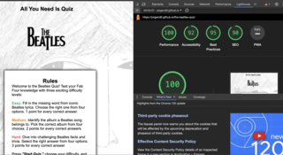

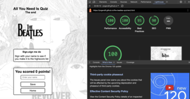

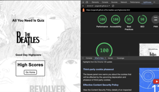

### Browser Test

* I tested my Website with : Safari, Google Chrome and Microsoft Edge. No errors occured on any device

<a id= "Vaildation">

### Validation

* I did HTML validations with [W3C HTML-Validator](https://validator.w3.org/#validate_by_input) with no errors or warnings on any of the 3 pages 
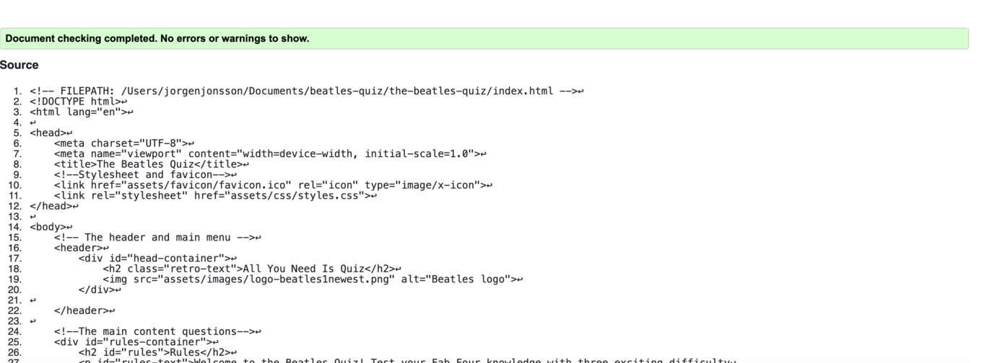

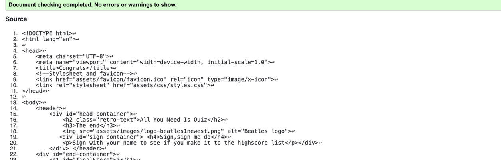

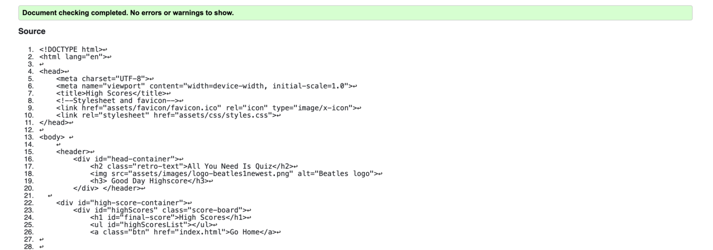

* I did a CSS validation with [W3C CSS-Validator](https://jigsaw.w3.org/css-validator/) with no errors or warnings shown

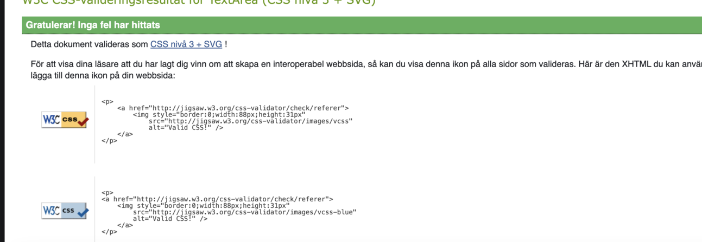

* I checked my JS files with [JsHint](https://jshint.com/) with no errors or warnings on any of my 3 JS files

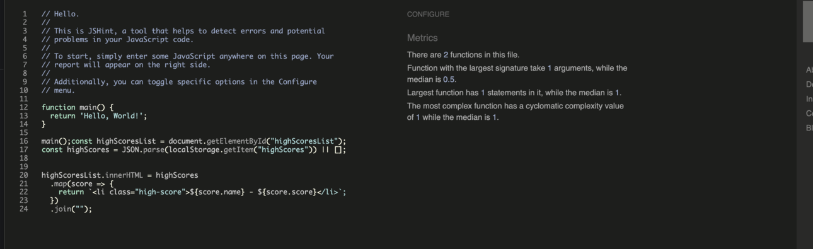

<a id ="bugs">

### Bugs

| Bug | Status | Description | Steps To Resolve |
| --- | --- | --- | --- |
| Answers Not Displaying |  ~~Resolved~~  | Answers weren't showing up; Spelled "questions" instead of "question" | Correct spelling to "question" |
| Unable to Choose Questions After Restart |  ~~Resolved~~  | Questions couldn’t be chosen after restart; Added `answeredQuestions = [];` at the end of reset game function| Added `answeredQuestions = [];` at the end of reset game function |
| End.html Navigation Issue |  ~~Resolved~~ | Couldn't navigate to end.html; Removed the "/" before end.html | Removed the "/" before end.html |
| High Score Reset Issue |  ~~Resolved~~  | High score reset to 0; Implemented a control check for an empty string when using JSON | Implemented a control check for an empty string with help from [Stackoverflow](https://stackoverflow.com/questions/51118396/uncaught-syntaxerror-unexpected-end-of-json-input-at-json-parse-anonymous ) |
| Start Menu Not Closing |  ~~Resolved~~ | Start menu wasn't closing when clicking outside; Added code to close menu when clicking outside | Added event listener and code to close the menu got help from [Stackoverflow](https://stackoverflow.com/questions/63028291/how-to-close-a-menu-bar-when-clicking-outside-of-it) |
| Low Lighthouse accessibility score| ~~Resolved~~ | Accessibility score was 82 in Lighthouse test.       | Added a title to the Spotify Playlist.   |

<a id="deployment">

# Depolyment

<a id="deployment-to-github" a>

### Deployment To Github
  

* Once code has been completed, it is pushed to Github for deployment using the pages feature. The site is now accessible via: [Beatles Quiz](https://jorgendif.github.io/the-beatles-quiz/)

Steps needed to deploy

* Navigate to the repository on github and click settings.
* Then select pages on the side navigation.
* Select the none dropdown, and then click main.
* Click on the save button.
* If any changes are required, they can be done, commited and pushed to GitHub and the changes  will be updated.

### Local Deployment

* Since I'm using VsCode my code is available locally

# Credit
 

 

 ### Content

 * The quiz is mainly inspired from a quiz by [Web Dev Simplified](https://www.youtube.com/watch?v=riDzcEQbX6k)

 * The scoring system is mainly inspired from [Love Maths](https://github.com/Code-Institute-Org/love-maths)

* How to shuffle the answers is done with inspiration from [Stack Overflow](https://stackoverflow.com/questions/2450954/how-to-randomize-shuffle-a-javascript-array)
and this video [Crypters Infotech](https://www.youtube.com/watch?v=shVEIHKhlZE )

* How to get different points depending on difficult level is done with inspiration from [MS 2 quiz](https://github.com/mateuszniechwiej/MS-2-Quiz-game/blob/master/assets/js/game.js) 

* The timer is implemented with inspiration from [Balen Nouris CL Quiz](https://balennouri.github.io/balennouri-project2/index.html) and [Coding Nepals Quiz App](https://www.youtube.com/watch?v=pQr4O1OITJo&t=1687s)
 

 * The questions is done with help from [Wikipedia](https://sv.wikipedia.org/wiki/Portal:Huvudsida) and [Google](https://www.google.com/webhp?hl=sv&sa=X&sqi=2&pjf=1&ved=0ahUKEwiQzf3sjK-DAxUJgf0HHS-gDMYQPAgJ)

 ### Media

 * The background image is borrowed from [Alpha Coders](https://in.pinterest.com/pin/722827808962805497/)

 * The Beatles logo is from [Creative Bloq](https://www.creativebloq.com/news/the-beatles-logo)

 * The music is from [Spotify](https://www.spotify.com/se/premium/?utm_source=se_brand_contextual_text&utm_medium=paidsearch&utm_campaign=alwayson_europe_se_performancemarketing_core_brand+contextual+text+exact+se+google&gad_source=1&gclid=Cj0KCQiAkKqsBhC3ARIsAEEjuJjHmhyVqcQPHK9Ng9q9lGzbfD1q1STkXI17v62YQWZP8-M1W6Q8-usaAshJEALw_wcB&gclsrc=aw.ds)

 

### Thank You

* My wife and family
* My Mentor
* Slack Community
* John,Paul,George and Ringo
* Spotify 

 

 

